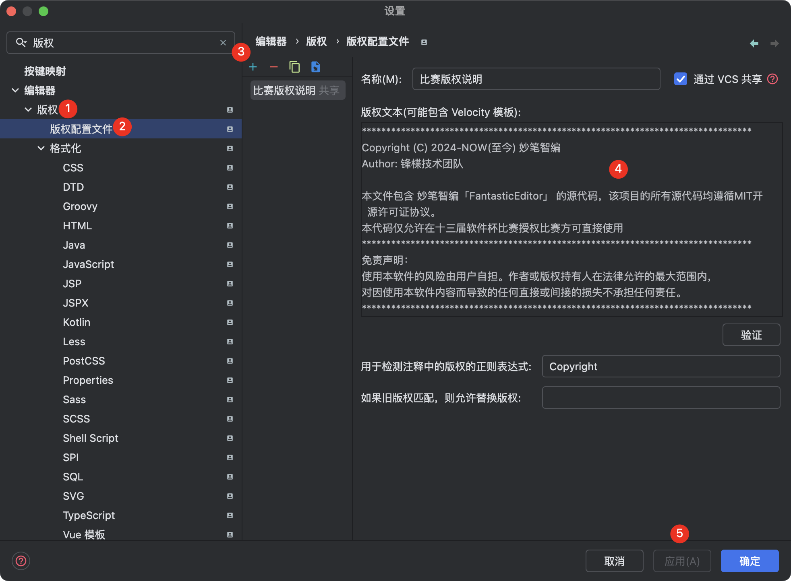

# 开发概要文档

## 开发周期

本项目开发周期预计为：**1个半月**（要求，每人开发需要按时完成分配的任务，以及对任务内未提及或隐藏部分完善出来）

## 开发前的准备事项

- **环境搭建**：确保具备必要的软件安装和环境配置，包括但不限于 `Node.js`, `Vue CLI`, `JDK-17`, `Kotlin`, `PostgreSQL`, `Redis` 以及 `Docker` 环境设置。
- **需求理解**：开发者需求解析分析，确保每位开发人员都能完全理解项目需求和业务逻辑。
- **设计评审**：进行系统设计评审，确保架构设计能够满足项目需求，同时保持良好的扩展性和维护性。
- **代码规范**：制定统一的代码编写规范和提交规范，确保代码质量和团队协作的高效性。
- **安全考虑**：加强对数据安全和隐私保护的重视，确保所有模块都采取合适的安全措施。
- **项目管理**：使用敏捷开发方法进行项目管理，定期进行迭代计划和回顾会议，保证项目按时进展。

## 项目开发

我们协作开发采用 git 进行，使用 github 平台进行项目管理与敏捷开发管理。

- 后端项目：[https://github.com/fantastic-editor/FantasticEditorApi](https://github.com/fantastic-editor/FantasticEditorApi)
- 前端项目：[https://github.com/fantastic-editor/FantasticEditorWeb](https://github.com/fantastic-editor/FantasticEditorWeb)

## 人员配置

- 曾昶雯【项目负责人|前端开发】
- 张睿相【后端开发|前端开发】
- 戴闯【后端工程|后端设计】

## 环境搭建

后端开发者前期需要准备 `JDK-17`, `Kotlin-1.9.22`, `Maven`, `PostgreSQL`, `Redis` 相应开发环境，统一使用 Jetbrains Intellij IDEA Ultimate 2023.3.X / [Jetbrains Intellij IDEA Ultimate 2024.1.X](https://www.jetbrains.com.cn/idea/)，`Docker` 环境选择配置，建议使用 `Docker` 部署 `PostgreSQL`、`Redis` 等服务。

前端开发者前期需要准备 `Node.js`, `Vue CLI` 相应开发环境，统一使用 Jetbrains WebStorm 2023.3.X / [Jetbrains WebStorm 2024.1.X](https://www.jetbrains.com.cn/webstorm/) ，无需额外配置 `Docker` 环境。

使用 Jetbrains Intellij IDEA Ultimate 为了保证开发者的开发规范请务必安装如下插件：

1. [Alibaba Java Coding Guidelines](https://plugins.jetbrains.com/plugin/14109-alibaba-java-coding-guidelines-xenoamess-tpm-)
2. [CheckStyle-IDEA](https://plugins.jetbrains.com/plugin/1065-checkstyle-idea)
3. [Git Commit Template Check](https://plugins.jetbrains.com/plugin/14822-git-commit-template-check)

使用 Jetbrains WebStorm 为了保证开发者开发规范请务必安装如下插件：

1. [Git Commit Template Check](https://plugins.jetbrains.com/plugin/14822-git-commit-template-check)

## 框架配置

### 后端

1. 使用主体框架 `SpringBoot-Kotlin 3.2.5 Maven`
      1. SDK配置
         - [5.1.1] [redis.clients: jedis](https://mvnrepository.com/artifact/redis.clients/jedis/5.1.1)
         - [2.10.1] [com.google.code.gson: gson](https://mvnrepository.com/artifact/com.google.code.gson/gson/2.10.1)
         - [5.2.5] [org.apache.poi: poi](https://mvnrepository.com/artifact/org.apache.poi/poi/5.2.5)
         - [5.2.5] [org.apache.poi: poi-ooxml](https://mvnrepository.com/artifact/org.apache.poi/poi-ooxml/5.2.5)
         - [4.5.14] [org.apache.httpcomponents: httpclient](https://mvnrepository.com/artifact/org.apache.httpcomponents/httpclient/4.5.14)
         - [3.5.6] [com.baomidou: mybatis-plus-spring-boot3-starter](https://mvnrepository.com/artifact/com.baomidou/mybatis-plus-spring-boot3-starter/3.5.6)
         - [3.5.16] [org.mybatis: mybatis](https://mvnrepository.com/artifact/org.mybatis/mybatis/3.5.16)
         - [latest] [org.springframework.boot: spring-boot-starter-data-redis](https://mvnrepository.com/artifact/org.springframework.boot/spring-boot-starter-data-redis)
         - [latest] [org.springframework.boot: spring-boot-starter-jdbc](https://mvnrepository.com/artifact/org.springframework.boot/spring-boot-starter-jdbc)
         - [latest] [org.springframework.boot: spring-boot-starter-security](https://mvnrepository.com/artifact/org.springframework.boot/spring-boot-starter-security)
         - [latest] [org.springframework.boot: spring-boot-starter-thymeleaf](https://mvnrepository.com/artifact/org.springframework.boot/spring-boot-starter-thymeleaf)
         - [latest] [org.springframework.boot: spring-boot-starter-validation](https://mvnrepository.com/artifact/org.springframework.boot/spring-boot-starter-validation)
         - [latest] [org.springframework.boot: spring-boot-starter-web](https://mvnrepository.com/artifact/org.springframework.boot/spring-boot-starter-web)
         - [latest] [org.springframework.boot: spring-boot-starter-mail](https://mvnrepository.com/artifact/org.springframework.boot/spring-boot-starter-mail)
         - [latest] [org.springframework.boot: spring-boot-starter-aop](https://mvnrepository.com/artifact/org.springframework.boot/spring-boot-starter-aop)
         - [latest] [org.thymeleaf.extras: thymeleaf-extras-springsecurity6](https://mvnrepository.com/artifact/org.thymeleaf.extras/thymeleaf-extras-springsecurity6)
         - [latest] [org.postgresql: postgresql](https://mvnrepository.com/artifact/org.postgresql/postgresql)
         - [latest] [org.projectlombok: lombok](https://mvnrepository.com/artifact/org.projectlombok/lombok)
         - [latest] [org.springframework.boot: spring-boot-starter-test](https://mvnrepository.com/artifact/org.springframework.boot/spring-boot-starter-test)
         - [latest] [org.springframework.security: spring-security-test](https://mvnrepository.com/artifact/org.springframework.security/spring-security-test)
         - [latest] [eu.bitwalker: UserAgentUtils](https://mvnrepository.com/artifact/eu.bitwalker/UserAgentUtils)
         - [latest] [com.fasterxml.jackson.module: jackson-module-kotlin](https://mvnrepository.com/artifact/com.fasterxml.jackson.module/jackson-module-kotlin)
         - [latest] [org.jetbrains.kotlin: kotlin-reflect](https://mvnrepository.com/artifact/org.jetbrains.kotlin/kotlin-reflect)
         - [latest] [org.jetbrains.kotlin: kotlin-stdlib](https://mvnrepository.com/artifact/org.jetbrains.kotlin/kotlin-stdlib)
      2. 架构打包
         - [dev] 开发架构
         - [test] 测试架构
         - [pord] 部署架构
2. 数据库采用 `PostgreSQL alpine3.19` 具体数据库设计逻辑见后
3. 缓存数据库采用 `Redis 7.2` 具体数据库样式逻辑见后
4. 云开发采用百度云系列产品进行对应特殊服务计算实现

### 前端

1. 使用框架 `Vue3`
2. 使用设计框架，主要为 `AntDesign` ，辅助设计为 `Tailwindcss`
3. 原型图设计工具 `Pixso`

## 接口规范

- 接口采用 Apifox 进行接口测试，已将各位开发者拉入团队项目内（可在 锋楪技术团队 -> FantasticEditor 中查阅到）
- Api 采用 `RESTful` 风格进行开发，具体额外开发规范请参考接口开发规范，对所有的业务请求中，若返回内容不正确，均会返回对应的HTTP状态码与请求内容。
- 具体其他接口内容参考规范后进行配置
- 使用 IDEA 插件 [Apifox Helper](https://plugins.jetbrains.com/plugin/20549-apifox-helper) 辅助进行接口文档编写与描述完善
- 对于所有接口，各位开发者需要完成对故障尽可能返回信息，对错误内容进行预案。避免出现未知错误导致程序无法按需进行。

## 版权说明

保证开发的版权意识以及后续的开源说明，请各位开发者在进行开发的时候添加版权内容

```markdown
********************************************************************************
Copyright (C) 2024-NOW(至今) 妙笔智编
Author: 锋楪技术团队

本文件包含 妙笔智编「FantasticEditor」 的源代码，该项目的所有源代码均遵循MIT开源许可证协议。
本代码仅允许在十三届软件杯比赛授权比赛方可直接使用
********************************************************************************
免责声明：
使用本软件的风险由用户自担。作者或版权持有人在法律允许的最大范围内，
对因使用本软件内容而导致的任何直接或间接的损失不承担任何责任。
********************************************************************************
```


