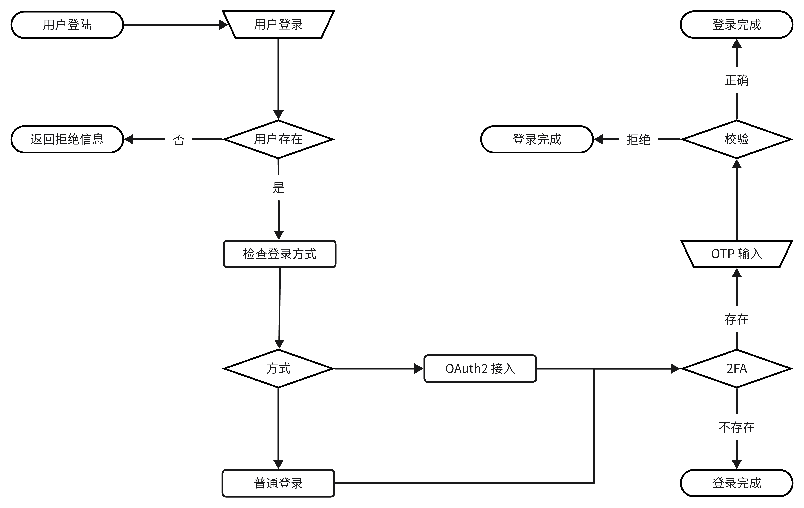

# 授权设计文档

> 授权设计文档是用作用户认证相关的设计文档

## 设计图

## 描述

- OTP 模式为令牌登录模式，即使用例如 `Google Authenticator`, `Microsoft Authenticator` 等令牌平台使用。
- 普通登录模式分为密码登录、手机号登录、与邮箱验证登录
    - 其中密码登录、邮箱登录时若设置了 OTP 登录则需要经过令牌验证，否则略过
    - 其中采用手机号验证则登录成功可忽略令牌验证
